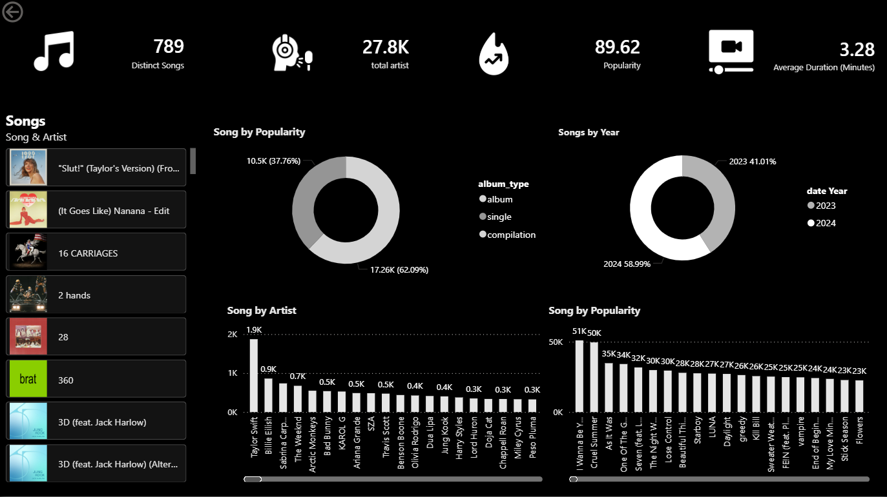
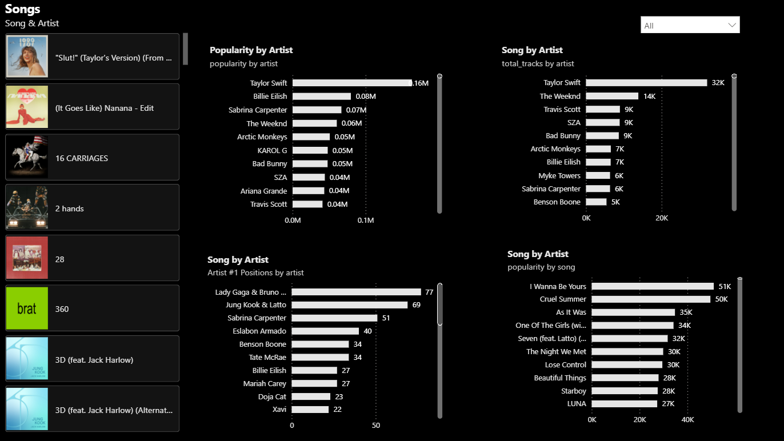

# 🎧 Spotify Music Analysis Dashboard (Power BI)

## 📊 Project Overview
This project analyzes Spotify music data using **Power BI** to understand song popularity, artist performance, and music trends.

The dashboard provides interactive visualizations to explore music insights.

---

## 🚀 Key Insights

- Total Songs: **789**
- Total Artists: **27.8K**
- Average Popularity Score: **89.62**
- Average Song Duration: **3.28 Minutes**

---

## 📈 Dashboard Features

### 1️⃣ Song Analysis
- Song popularity distribution
- Song list with artist details

### 2️⃣ Artist Insights
- Top artists by popularity
- Artist song counts

### 3️⃣ Yearly Trends
- Songs released by year
- Album type distribution

---

## 🛠 Tools Used

- **Power BI**
- **Data Modeling**
- **DAX**
- **Data Visualization**

---

## 📷 Dashboard Preview

### Overview

### Artist Analysis

---

## 📂 Project Structure

